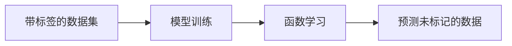

## 监督学习的基本要点

 
 

```mermaid{theme: 'neutral', scale: 1.25}
graph LR
    A[带标签的数据集]
    B[模型训练]
    C[函数学习]
    D[预测未标记的数据]
    A --> B
    B --> C
    C --> D
```

<!-- 

有关监督学习的要点，简要来说就是用一个带标签的数据集用于模型的训练。在训练过程中，模型学习到一个函数，这个函数用于对输入数据进行预测。一旦函数被学习完成，模型就可以被用于预测未标记的数据。 

-->

