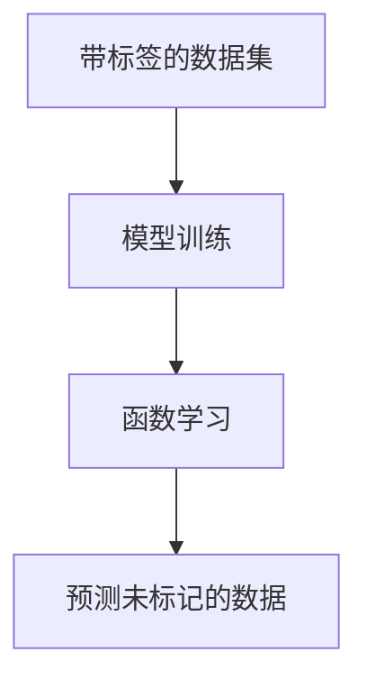

## 监督学习的基本要点

Andrew NG: What is supervised learning.

<!-- 

有关监督学习的要点，简要来说就是用一个带标签的数据集用于模型的训练。在训练过程中，模型学习到一个函数，这个函数用于对输入数据进行预测。一旦函数被学习完成，模型就可以被用于预测未标记的数据。 

右图是吴恩达教授讲解监督学习时的配图，监督学习简单来说就是模型从标记的数据中学习到一个函数，输入x，模型能根据所学输出x对应的y。

-->

