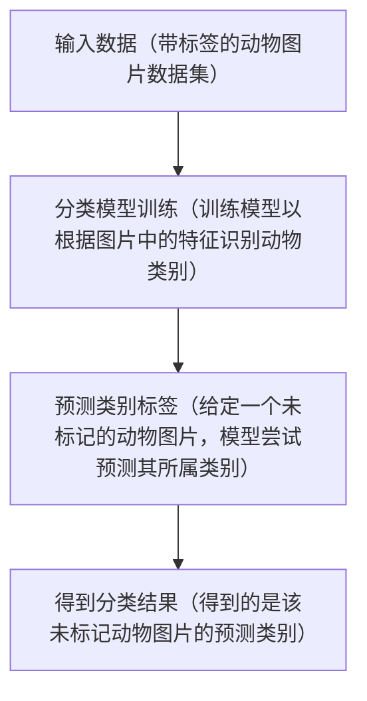

## 分类问题概述（预测离散值/类别标签）

 
 

<!-- 

监督学习的最核心的两大问题是分类问题和回归问题，下面我来介绍监督学习在这两大问题方面的应用。

先来简单地介绍一下分类问题。

如幻灯片所示，分类问题的核心目标是预测离散值或类别标签。这与之后要讲的回归问题预测连续值的目标形成了鲜明的对比。

为了方便理解，我们使用动物图片分类的例子来揭示分类问题的基本流程：

1、首先，我们有一个带标签的动物图片数据集。这些图片都带有对应的动物名称标签，例如“狗”、“猫”等。

2、接着，我们使用这些带标签的图片来训练一个分类模型。这个模型将学习如何根据图片中的动物特征来识别并预测动物类别。

3、一旦模型训练完成，我们可以使用它来对那些没有标签的动物图片进行预测。模型将尝试根据它在训练过程中所学到的知识来预测图片中动物的类别。

4、最后，我们得到了模型的预测结果，即该图片所属的动物类别。

-->