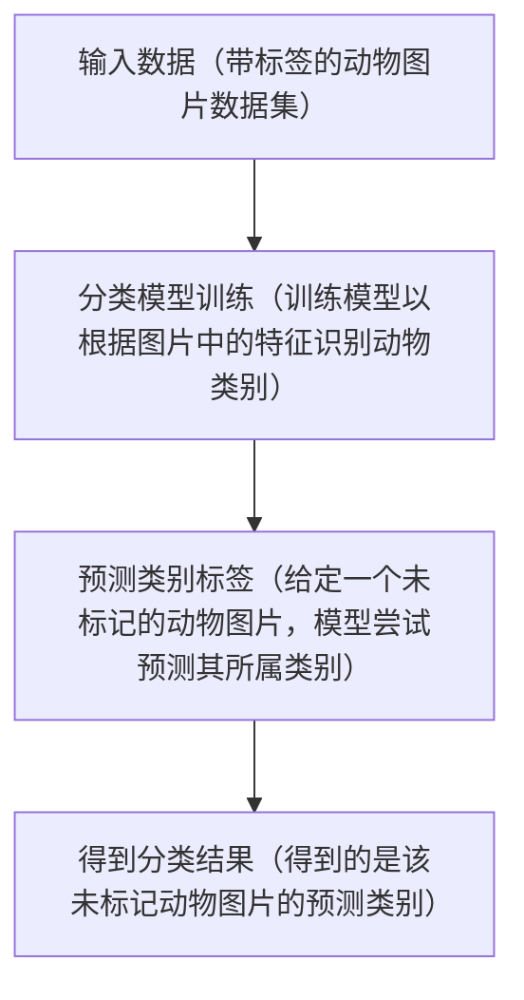

## 分类问题概述（预测离散值/类别标签）

 
 

<!-- 在这一页中，我们将深入探讨分类问题的基本概念。如你所见，分类问题的核心目标是预测离散值或类别标签。这与之后要讲的回归问题预测连续值的目标形成了鲜明的对比。

让我们从左到右看这个流程图。为了方便理解，我们使用动物图片分类的例子来揭示分类问题的基本流程：

1、输入数据：首先，我们有一个带有标签的动物图片数据集。这些图片都带有对应的动物名称标签，例如“狗”、“猫”或“鸟”。

2、分类模型训练：在这一步，我们使用这些带标签的图片来训练一个分类模型。这个模型将学习如何根据图片中的动物特征来识别并预测动物类别。

3、预测类别标签：一旦模型训练完成，我们可以使用它来对那些没有标签的动物图片进行预测。模型将尝试根据它在训练过程中所学到的知识来预测图片中动物的类别。

4、得到分类结果：最后，我们得到了模型的预测结果，即该图片所属的动物类别。

分类问题是监督学习中的一个核心问题，它涉及到识别和预测数据点的特定类别。 -->