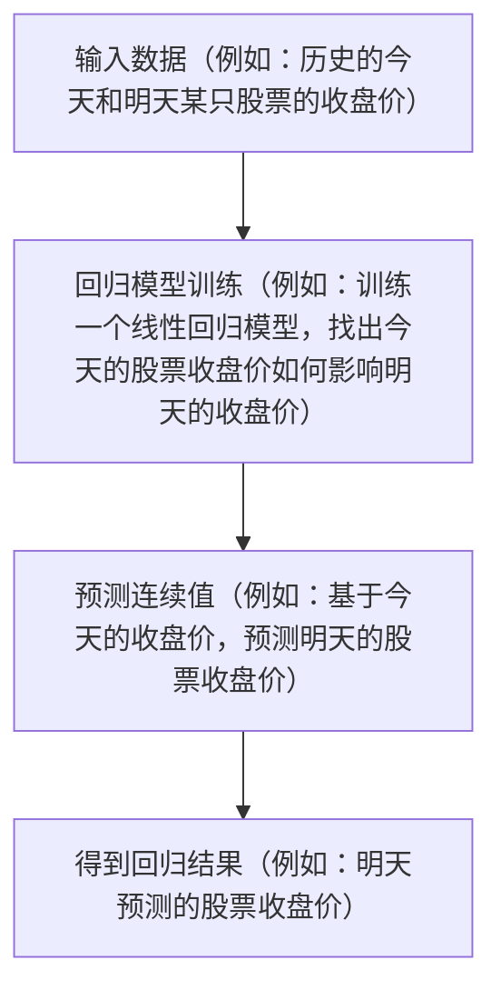

# 回归问题（预测连续值）

 
 

<!-- 在这一页中，我们将探索回归问题的基本概念。

与分类问题不同，回归问题的核心目标是预测一个连续的值。这意味着，我们试图预测一个实数值，如价格、得分或其他任何连续范围内的数值。而不是预测输入数据属于哪个离散的类别

让我们从左到右看这个流程图。为了方便理解，我们使用股票明天收盘价预测的例子来揭示回归问题的基本流程：

1. 输入数据：首先，我们需要收集相关的数据，例如，我们可以使用股票在历史的今天和明天的收盘价。
2. 回归模型训练：接着，我们使用这些历史数据来训练我们的线性回归模型。模型将学习今天的收盘价如何影响明天的收盘价。
3. 预测连续值：训练完成后，我们可以输入今天的股票收盘价，模型则会为我们预测明天可能的收盘价。
4. 得到回归结果：最后，模型会输出预测的收盘价，这就是我们基于今天数据预测的明天的股票收盘价。

通过这个流程，我们可以看到回归如何帮助我们基于历史数据做出有根据的预测。-->