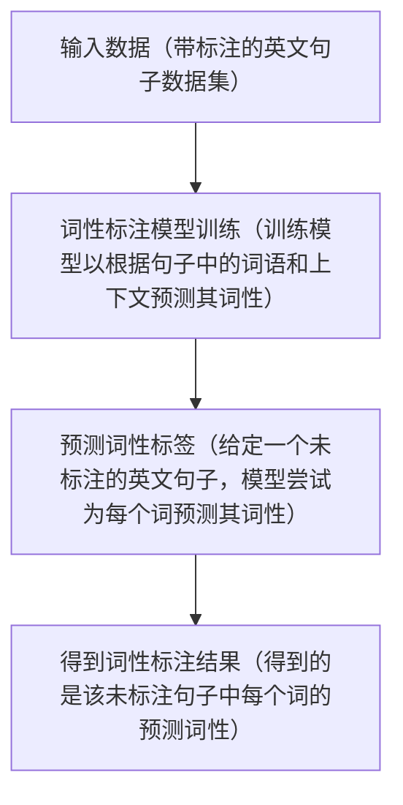

## 标注问题（分类问题的扩展，预测离散值/类别标签）

 
 

<!-- 

在这一页中，我们将探讨一个与分类问题密切相关的概念，那就是标注问题。

标注问题可以被看作是分类问题的一种扩展。与分类问题主要关注为单个输入预测一个类别标签不同，标注问题的目标是为输入数据序列中的每一个元素分配一个对应的标签。

为了方便理解，我们使用英语句子词性标注（为文本中的每个单词指定一个合适的词性）的例子来揭示标注问题的基本流程：

1、首先，我们从一个带有词性标注的英文句子数据集开始。这些句子包含了词语及其对应的词性标签，如名词、动词、形容词等。

2、接着，我们根据输入的句子及其标注来训练模型。模型将学习如何根据上下文和句子中的具体词语来预测每个词的词性。

3、训练完成后，模型可以被用来预测新的、未标注的英文句子。对于句子中的每一个词，模型都会预测其可能的词性。

4、最后，我们获得了模型对句子中每个词的词性预测结果，即为每个词提供了一个词性标签。

标注问题提供了一种更细粒度的分类方法，允许我们为输入数据的每个元素预测一个类别标签，而不仅仅是为整个输入预测一个标签。

-->